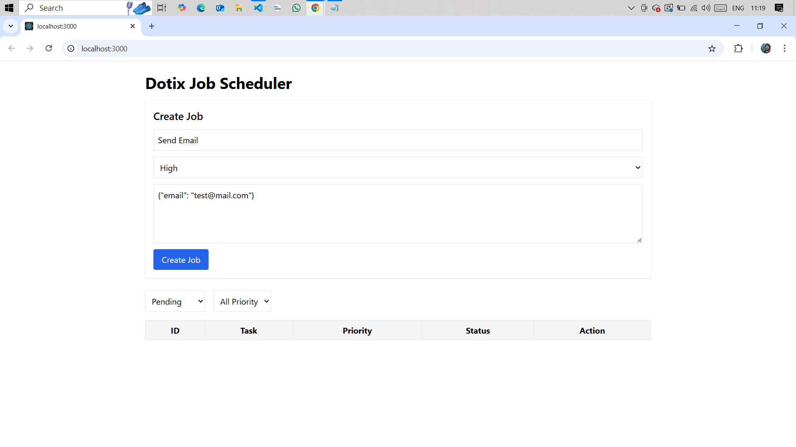
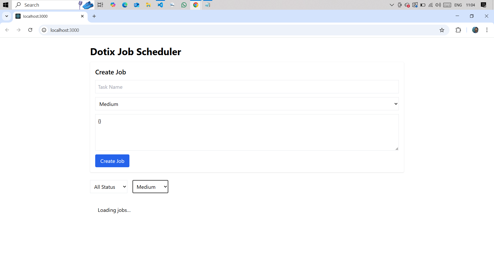
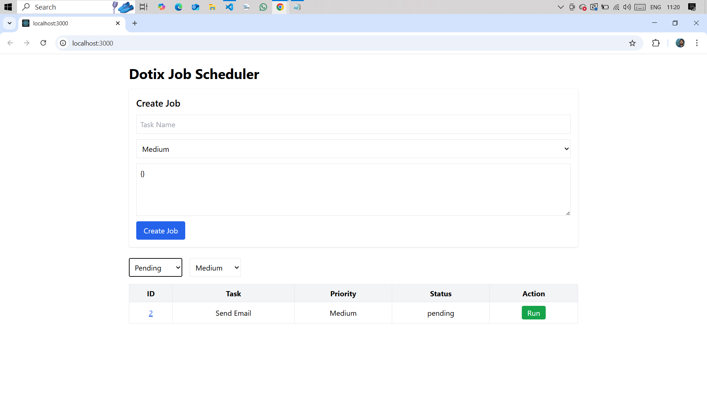
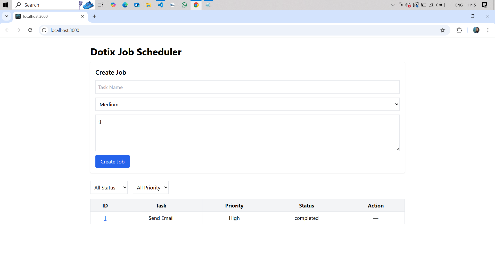
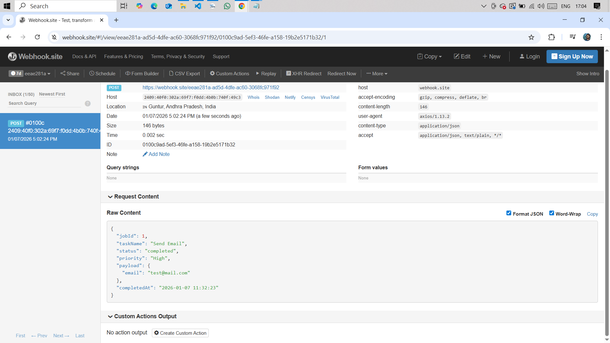

# Dotix – Job Scheduler & Automation System

## Objective
A mini job scheduling system that allows users to create background jobs,
track their execution status, manually run jobs, and automatically notify
external systems using webhooks when jobs complete.

---

## Tech Stack
**Frontend**
- React
- Tailwind CSS
- React Router

**Backend**
- Node.js
- Express
- SQLite

**Integration**
- 'https://webhook.site/eeae281a-ad5d-4dfe-ac60-3068fc971f92'

---

## Features
- Create background jobs
- View all jobs in a dashboard
- Filter jobs by status and priority
- Run jobs manually
- Track job lifecycle (pending → running → completed)
- Trigger webhook automatically on job completion
- View detailed job information

---

## Job Execution Flow
Create Job → Pending → Run Job → Running → Completed → Webhook Triggered

## Screenshots

## Screenshots

### Create Job


### Dashboard


### Run Job


### Job Details


### Webhook Triggered


## How to Run Locally

### Backend
```bash
cd backend
npm install
node app.js

### Frontend

```bash
cd frontend
npm install
npm start
